# Game
André Tessmer, João Ramos, Vinicius Rossoni

# Triangulo
Estrutura do Triangulo, lógica de rotação, translação...
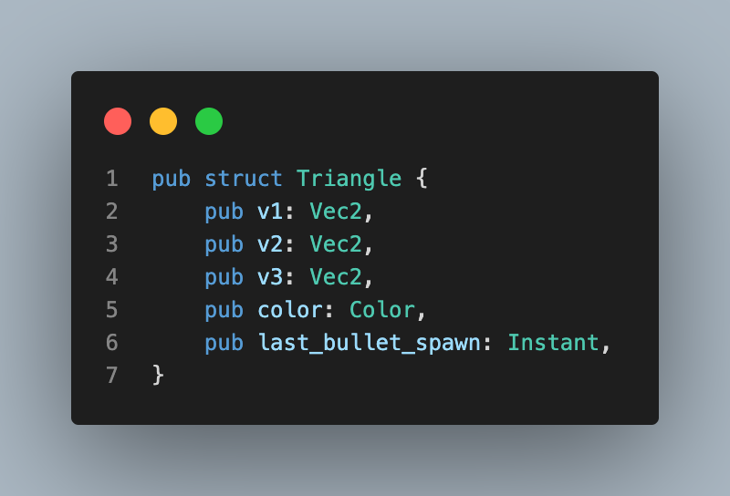

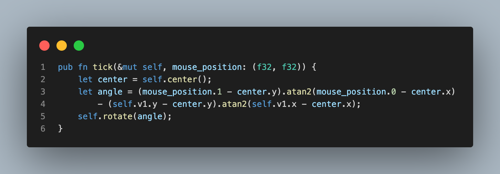
a cada tick, rotacionamos o triangulo para apontar para o mouse.

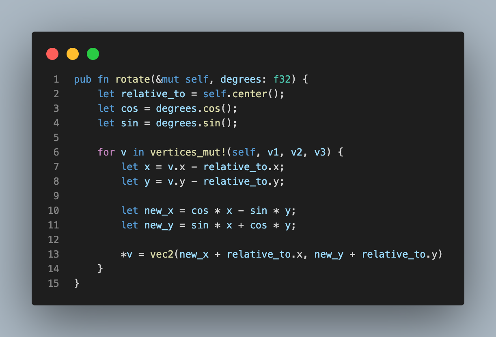
recebe quantos graus deve rotacionar, utilizando multiplicação de matriz em relação ao centro do triangulo.

# Enemy
Estrutura do Enemy, lógica de seguir, tomar dano...
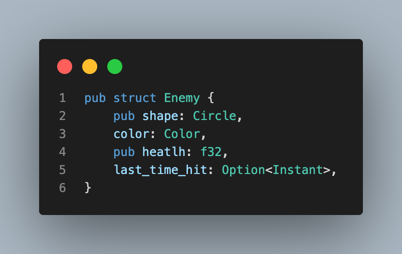

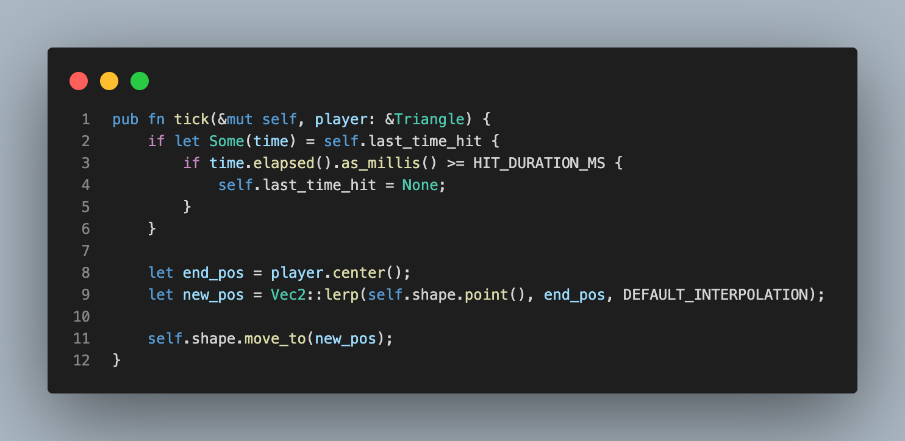
A cada tick do looping, calculamos e movimentamos o inimigo para uma nova posição, em direção ao player.

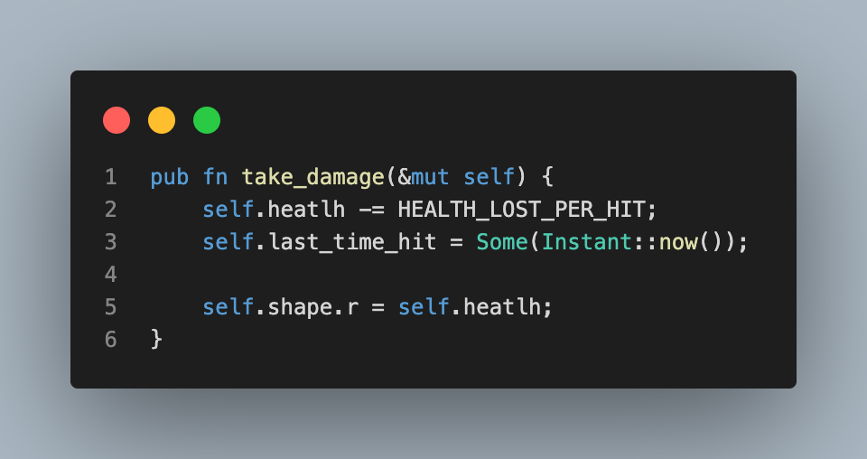
Diminuir o raio do circulo quando toma dano.

# Bullet
Representado por um retangulo
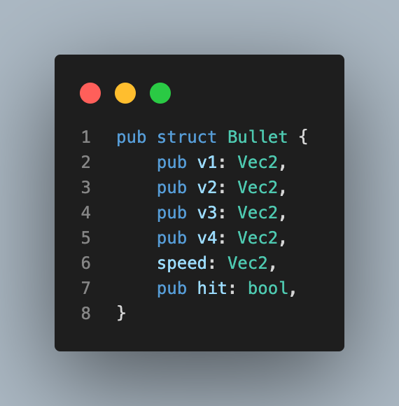

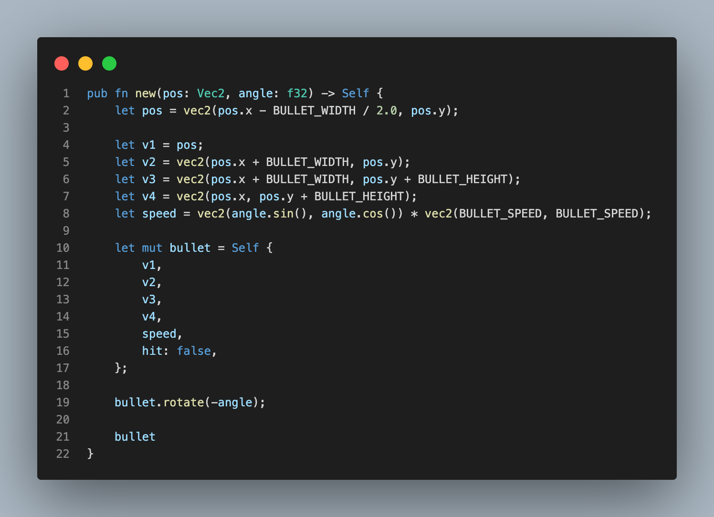
Lógica de criação da bullet dependendo do angulo do triangulo.

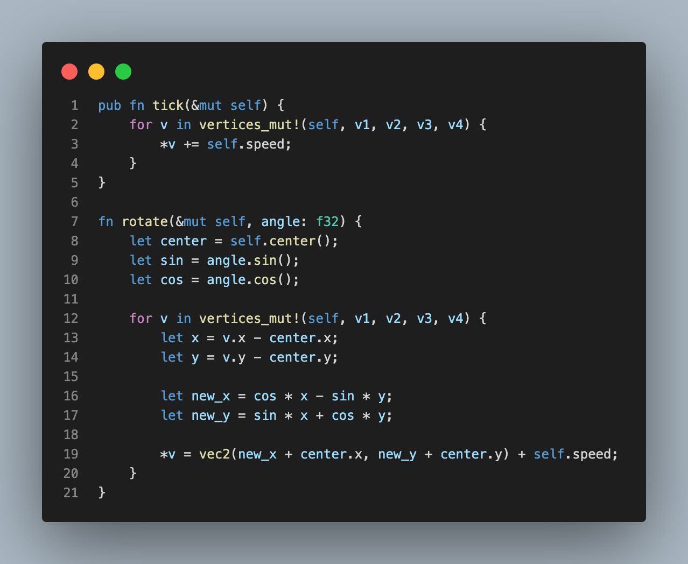
A cada tick vamos alterando a posição de todos os vértices para simular o tiro indo.

Rotação do tiro. Depende do angulo do triangulo.

# Main
Estruturação e lógica de funcionamento do jogo

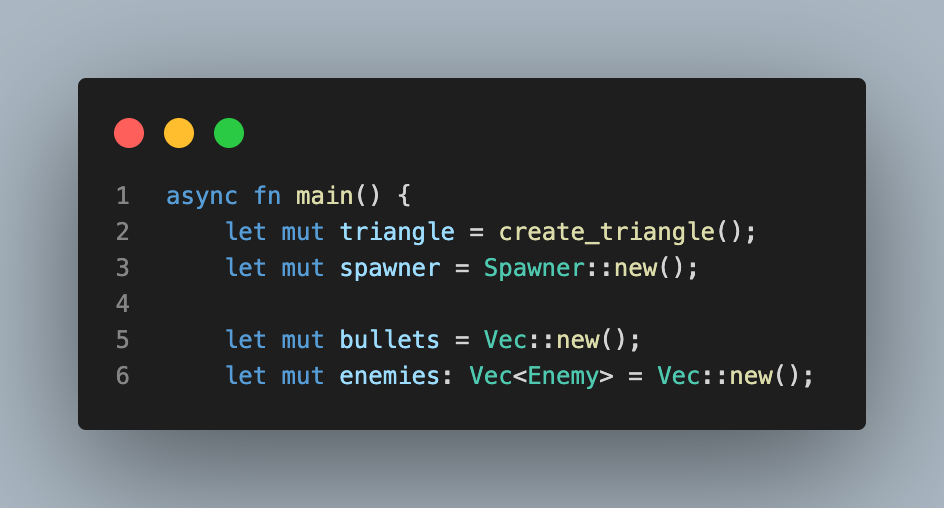
- `triangle` segura a instancia do nosso triangulo
- `spawner` segura a instancia do nosso spawner, responsavel por spawnar ou não novos inimigos
- `bullets` segura os tiros que estão/vão ser desenhados na tela
- `enemies` segura os inimigos que estão/vão ser desenhados na tela.

depois disso, iniciamos o looping principal
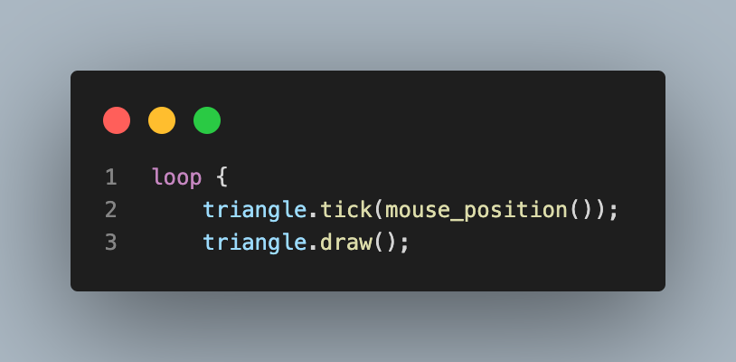

dentro do looping principal, verificamos se há colisão do circulo com o triangulo

ainda dentro do looping, verificamos se há colisão de algum tiro com algum inimigo.
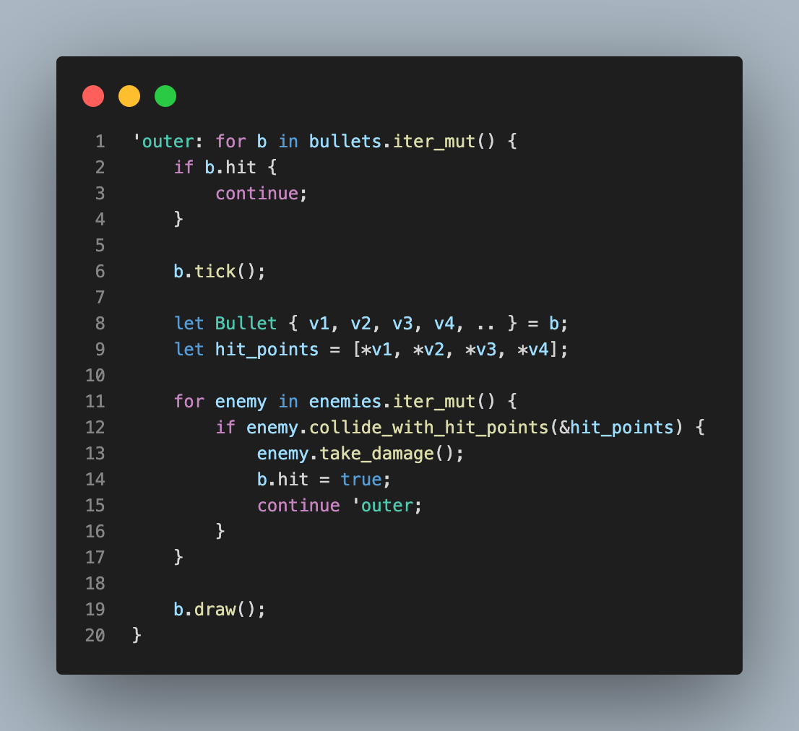

