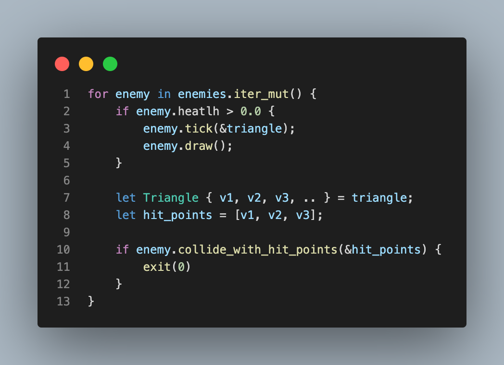

# Game
André Tessmer, João Ramos, Vinicius Rossoni

# Triangulo
Estrutura do Triangulo, lógica de rotação, translação...

# Main
Estruturação e lógica de funcionamento do jogo

- `triangle` segura a instancia do nosso triangulo
- `spawner` segura a instancia do nosso spawner, responsavel por spawnar ou não novos inimigos
- `bullets` segura os tiros que estão/vão ser desenhados na tela
- `enemies` segura os inimigos que estão/vão ser desenhados na tela.

depois disso, iniciamos o looping principal

dentro do looping principal.

<!-- 

## Enemy damage

## Triangle struct

v1, v2 e v3 - representam os vértices do triangulo

## Triangle rotate

recebe quantos graus deve rotacionar, utilizando multiplicação de matriz em relação ao centro do triangulo.

## Triangle translate

dependendo da direção da movimentação, alteramos x ou y de todos os vértices de acordo. -->

